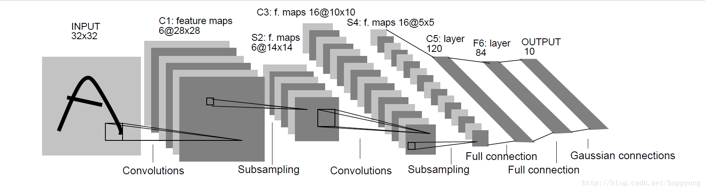

# 一、简介

[LeNet-5](https://cuijiahua.com/blog/tag/lenet-5/)出自论文Gradient-Based Learning Applied to Document Recognition，是一种用于手写体字符识别的非常高效的卷积神经网络。

关于LeNet5的解读欢迎查看博客[浅谈LeNet-5](https://blog.csdn.net/qq_43058685/article/details/89072678)




# 二、项目下载

运行环境为tensorflow1.8.0+cuda9.0+cudnn7.0

```shell
git clone https://github.com/jiang4869/LeNet5-Tensorflow-MNIST.git
cd LeNet5-Tensorflow-MNIST
python train.py
```

